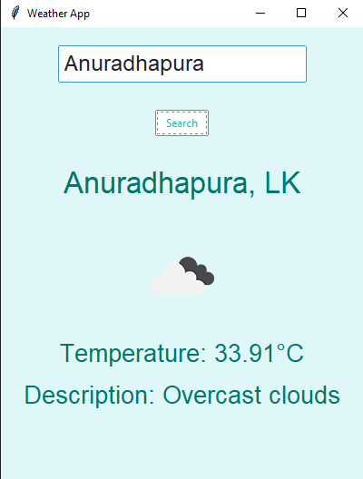

# Weather Application 🌦️

A simple and elegant weather application built with Python using the `tkinter` and `ttkbootstrap` libraries. This application allows users to search for the current weather of any city, displaying details such as temperature, weather description, and an icon representing the weather conditions.

## Features
- **Real-time Weather Information**: Fetches and displays up-to-date weather information for any city using the OpenWeatherMap API.
- **User-Friendly Interface**: Designed with a modern and attractive light theme using `ttkbootstrap` for a clean and responsive UI.
- **Weather Icons**: Displays appropriate weather icons based on the current weather conditions.
- **Error Handling**: Provides feedback if the city is not found or if an API error occurs.

## Technologies Used
- **Python**: Core programming language for building the application.
- **tkinter**: Python's built-in library for GUI development.
- **ttkbootstrap**: A modern extension of `ttk` with themed widgets for an enhanced user interface.
- **Pillow**: For handling and displaying weather icons.
- **OpenWeatherMap API**: Fetches weather data based on the user's input city.

## Setup & Installation
1. Clone the repository:
    ```bash
    git clone https://github.com/your-username/weather-application.git
    ```
2. Navigate to the project directory:
    ```bash
    cd weather-application
    ```
3. Install the required dependencies:
    ```bash
    pip install requests Pillow ttkbootstrap
    ```
4. Run the application:
    ```bash
    python WeatherApp.py
    ```

## Usage
- Enter the city name into the input field and click the "Search" button to get the current weather details.
- The app displays the city name, temperature (in Celsius), weather description, and an icon representing the weather.

## Contributing
Contributions are welcome! Feel free to submit a pull request or open an issue for any improvements or suggestions.

## License
This project is open-source and available under the [MIT License](LICENSE).
